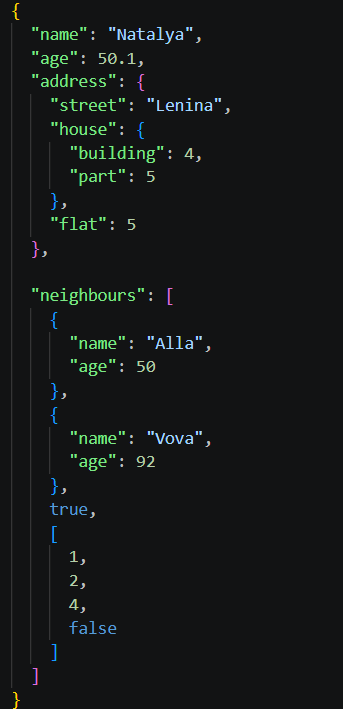
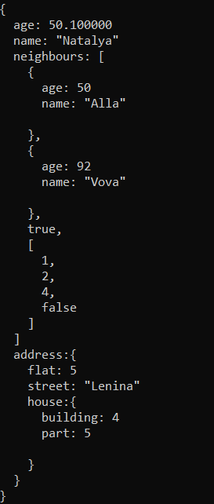
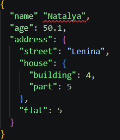
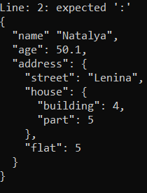

# JSON Parser

An educational, lightweight JSON parser and configuration manager, written from scratch in C++. This project was created to understand the mechanisms of tokenization, parsing, and type‑safe data structures without relying on existing libraries.

## Architecture and main classes

* **`ConfigValue`**: manages the data types extracted from JSON. To store and process various types (`int`, `double`, `bool`, `std::string`, arrays, and nested nodes), `std::variant` is used, which ensures type safety.
* **`ConfigNode`**: responsible for the configuration hierarchy and path routing. Allows you to query deeply nested properties using paths with dots (for example, `server.network.port`).
* **`JsonParser`**: the main processing mechanism. Reads raw data in JSON format and distributes it to the corresponding nodes.

## How it works

The parsing algorithm is simple.
1. It reads the source file **character by character**.
2. It actively monitors compliance with the format.
3. If an invalid JSON syntax is detected in the input file, the parser safely terminates and reports the line number where the violation occurred.

### Examples of use

Here’s how the parser handles valid Json configurations and syntax errors:

#### Case 1: Valid JSON Parsing
<table>
  <tr>
    <td width="50%"><b>JSON File</b></td>
    <td width="50%"><b>Parsed Output</b></td>
  </tr>
  <tr>
    <td></td>
    <td></td>
  </tr>
</table>

#### Case 2: Handling Syntax Error
<table>
  <tr>
    <td width="50%"><b>Invalid JSON File</b></td>
    <td width="50%"><b>Parser Error Log</b></td>
  </tr>
  <tr>
    <td></td>
    <td></td>
  </tr>
</table>

---

### TODO
- Implement reverse parsing so that `ConfigNode` trees can be exported back to valid `.json` files.
- Convert the character‑by‑character scanner into a more reliable tokenizer with lookahead.
- Add full support for escape characters for strings (`\n`, `\t`).
